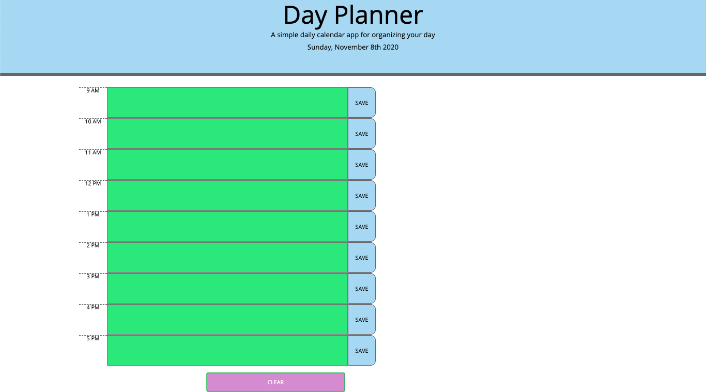

# Day-Planner

This app allows the user to input whatever events/plans they have into the desired time slot and click the save button to "schedule" the event. The app will hold the event in place for them using their local browser storage. It also indicates time by making future time-slots green, current time-slots orange, and past time-slots purple. Whenever the user is ready to finished with their day, they may click the clear button to clear their day planner. Below is what the user will see when they visit the page: 

The user can access the page here: https://jesscru.github.io/day-planner/